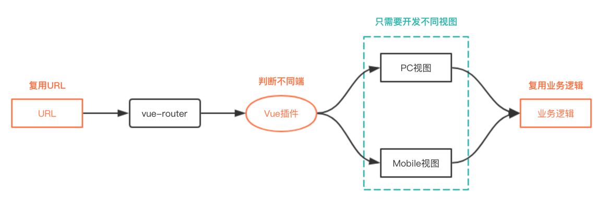

# vue-platform

[](https://badge.fury.io/js/vue-platform)

[](https://nodei.co/npm/vue-platform/)

vue-platform是一个Vue插件，区分PC端和H5移动端，支持针对不同端展示不同的视图层，实现业务逻辑的多端复用

### 使用背景

1、对于已有的PC项目，想对系统中某一部分模块移动化（业务逻辑基本一致，只有视图层存在差异），为了提高开发效率，决定在原代码结构上进行开发，复用原有 URL 和业务逻辑，只需开发视图层即可

2、使用 `vue-platform` 插件区分PC端和H5移动端，针对不同端动态加载不同的 Vue 组件来切换视图层

### 实现

判断优先级：

1、判断 `query` 中的 `_platform`

2、读取 `localStorage` 中的 `_platform`

3、解析 `userAgent`

4、最后将结果存储到 `localStorage` 的 `_platform` 字段，方便后续访问页面直接使用

<p align="left">
    
</p>

### 使用

#### 安装

``` bash
$ npm install vue-platform
```

#### 使用

##### app.js

``` js
import vuePlatform from 'vue-platform';

Vue.use(vuePlatform);
```

##### middle.vue

``` html
<template>
    <component :is="content"></component>
</template>

<script>
    import pc from './pc.vue';
    import mobile from './mobile.vue';

    export default {
        data () {
            return {
                content: 'pc',
            };
        },
        created () {
            if (this.$platform === '2') {
                this.content = 'mobile';
            }
        },
        components: {
            pc,
            mobile,
        },
    };
</script>
```

* `this.$platform === '1'` => pc

* `this.$platform === '2'` => mobile

### 实例

[DEMO](https://hujiaohj.github.io/vue-platform/example/dist/index.html)，打开页面之后，可以：

* 添加 `?_platform=2`，刷新页面，查看效果
* 删除 `?_platform=2`，修改`localStorage`中`platform`字段值分别为 1 和 2 ，刷新页面，查看效果
* 清空 `localStorage`，将开发者工具调整为H5模式，刷新页面，查看效果

#### 本地运行

在 `example` 目录下，执行以下脚本：

``` bash
$ npm run dev # 启动本地服务
$ npm run build # 打包
```

实例使用的 [parcel](https://en.parceljs.org/) 进行项目构建，所以也可以直接执行以下脚本：

``` bash
$ parcel index.html # 启动本地服务
$ parcel build index.html --public-url ./ # 打包
```